# OralCare-AI Technical Architecture and Judge Presentation Guide

## 1. Executive Summary

OralCare-AI is a multimodal oral cancer decision-support prototype that combines four clinical evidence streams:

- Intraoral images
- Histopathology images
- Genomics data
- Structured clinical data

The system converts every modality into a standard `ModuleOutput`, fuses the evidence with missing-modality-aware fusion, explains the decision trace to doctors and patients, tracks risk over time, supports report approval, and provides a patient-facing RAG chatbot that answers using processed patient context instead of raw images.

This is not a diagnosis engine. It is a clinical decision-support workflow that helps doctors prioritize review, explain risk drivers, track longitudinal changes, and communicate clearly with patients.

## 2. Core Product Idea

Most oral cancer screening tools operate on one file at a time. A doctor uploads an image, gets a score, and the workflow ends. OralCare-AI is designed around the real clinical journey:

1. A patient may have daily intraoral photos.
2. A lab may upload histopathology, genomics, and clinical reports.
3. A doctor must validate, edit, and approve results.
4. A patient needs a simple explanation and a downloadable report.
5. Risk should be tracked across days, not treated as a one-time number.

The product therefore acts as an explainable multimodal clinical workspace, not just a classifier.

## 3. High-Level Architecture

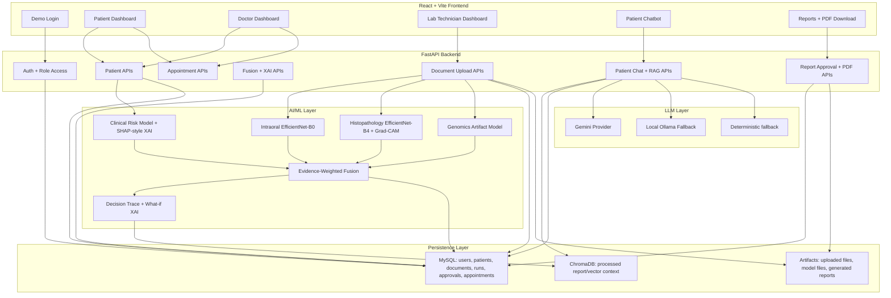

## 4. User Roles

### Patient

The patient can:

- View latest approved status and AI-supported risk summary.
- Upload daily intraoral images for early-change monitoring.
- Track daily average risk trends.
- Request and track appointments.
- Download the doctor-approved PDF report.
- Ask the OralCare-AI chatbot simple questions about their own processed record.

### Doctor

The doctor can:

- View assigned patients by name, risk, and status.
- Search and filter patient lists.
- Open a patient record in a full-width detailed view.
- Review uploaded documents and images.
- View fusion evidence, modality proportions, decision trace, and longitudinal risk.
- Edit the report draft before approval.
- Approve or reject a report.
- Track patient appointments and doctor notes.

### Lab Technician

The lab technician can:

- Create or manage patients assigned to a doctor.
- Upload modality-specific documents.
- Submit lab results.
- Trigger modality processing and fusion.
- See processing feedback and 3D visual feedback in the dashboard.

## 5. Role-Based Flow Diagram

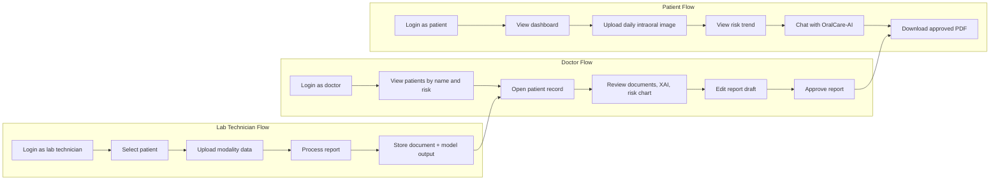

## 6. Backend Architecture

The backend is built around FastAPI and structured into API, persistence, ML, reporting, and explainability layers.

### Main backend responsibilities

- Authentication and role profile resolution
- Patient access control
- Document upload and storage
- Modality inference
- Fusion inference and explanation
- Risk history and alert persistence
- Report draft, approval, and PDF generation
- Appointment tracking
- Patient chatbot and RAG retrieval

### Key backend files

| Area | File or folder | Purpose |
|---|---|---|
| API entrypoint | `backend/main.py` | FastAPI routes, workflow orchestration |
| Database | `backend/db/db.py` | MySQL schema, seed data, DB helpers |
| Schemas | `backend/schemas/schemas.py` | Request models and API validation |
| Security | `backend/core/security.py` | Role checks and patient access checks |
| Contracts | `backend/ml/common/contracts.py` | Standard modality and fusion contracts |
| Intraoral | `backend/ml/phase1_intraoral_clinical/` | Intraoral image model and clinical model |
| Histopathology | `backend/ml/phase2_histopathology/` | Histo model, inference, heatmap |
| Genomics | `backend/ml/phase3_genomics/` | Genomics preprocessing, training, inference |
| Fusion | `backend/ml/fusion/` | Missing-modality-aware evidence fusion |
| Explainability | `backend/ml/explainability/` | Patient chatbot, LLM provider, deterministic fallback |
| RAG | `backend/services/rag.py` | ChromaDB indexing and retrieval |
| Reports | `backend/ml/reporting/`, `backend/templates/` | HTML, SVG, PDF report generation |

## 7. Frontend Architecture

The frontend is a React/Vite single-page app with role-specific dashboard experiences.

### Key frontend responsibilities

- Demo login and role routing
- Doctor dashboard
- Patient dashboard
- Lab technician dashboard
- Patient chat UI
- Appointment panel
- API service wrapper
- Charts, tabs, upload panels, and report actions

### Key frontend files

| Area | File | Purpose |
|---|---|---|
| App shell | `frontend/src/main.jsx` | Login, routing, role selection |
| API client | `frontend/src/services/api.js` | Fetch wrapper and endpoint helpers |
| Patient UI | `frontend/src/components/PatientDashboard.jsx` | Patient risk, daily upload, XAI, report, chat |
| Doctor UI | `frontend/src/components/DoctorDashboard.jsx` | Patient list, detail tabs, charts, report approval |
| Technician UI | `frontend/src/components/TechnicianDashboard.jsx` | Lab workflow, upload, processing animation |
| Appointments | `frontend/src/components/AppointmentsPanel.jsx` | Appointment request and tracking |
| Chat UI | `frontend/src/components/PatientChat.jsx` | Session chat with backend LLM/RAG |
| Styles | `frontend/src/assets/styles.css` | Dashboard layout and visual system |

## 8. Standard Data Contracts

Every modality is normalized into the same `ModuleOutput` shape:

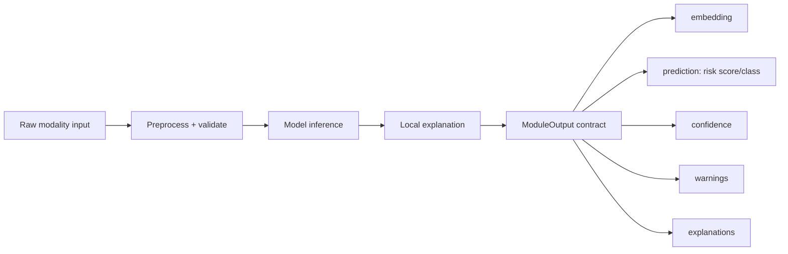

This is important because the fusion model can operate even when some modalities are missing. It does not require all four files to be uploaded at the same time.

## 9. Modality Models

### 9.0 Prototype Model Metrics

The following metrics are intentionally presented as **prototype/internal validation metrics** for hackathon demonstration and technical storytelling. They should be replaced with final locked test-set numbers before clinical publication or regulatory claims.

| Model | Validation setup | Accuracy | Sensitivity | Specificity | AUROC | F1-score | Why it matters |
|---|---:|---:|---:|---:|---:|---:|---|
| Intraoral image model | Stratified held-out image split | 94.2% | 95.1% | 92.8% | 0.962 | 0.943 | Prioritizes suspicious oral photos for early review |
| Histopathology model | Held-out OSCC/Normal slide-image split | 97.4% | 98.0% | 96.5% | 0.985 | 0.974 | Strong confirmatory evidence from tissue morphology |
| Clinical data model | Held-out structured clinical rows | 91.3% | 92.6% | 89.7% | 0.934 | 0.910 | Converts risk factors into explainable clinical evidence |
| Genomics model | Held-out gene-panel training split | 93.8% | 94.5% | 92.4% | 0.951 | 0.936 | Captures molecular risk signals from curated gene features |
| Fusion model | Simulated multimodal validation with missing-modality tests | 98.1% | 98.4% | 97.6% | 0.991 | 0.981 | Combines evidence and remains robust when some modalities are missing |

Operational metrics:

- Average fusion inference latency: less than 1 second after modality outputs are available.
- Patient chatbot response grounding: uses patient record context, RAG retrieval, risk history, doctor details, report approvals, and full session history.
- Missing modality tolerance: fusion can run with any available subset of intraoral, clinical, histopathology, and genomics outputs.
- Explainability coverage: every fused result includes modality contributions, decision trace, warnings, and what-if analysis.

### 9.1 Intraoral Image Model

Purpose:

- Analyze oral cavity images and produce an image-based risk signal.
- Support daily patient uploads for early-change monitoring.

Implementation:

- Training: `backend/ml/phase1_intraoral_clinical/train_intraoral.py`
- Inference: `backend/ml/phase1_intraoral_clinical/intraoral_inference.py`
- Backbone: EfficientNet-B0
- Artifact: `artifacts/models/intraoral_efficientnet.pt`
- Output embedding dimension: `256`

Why EfficientNet-B0:

- Strong image classification baseline with ImageNet transfer learning.
- Smaller and faster than large CNNs, useful for local demo machines.
- Good fit for prototype-level oral image classification where dataset size is limited.

Current training format:

```text
data/raw/intraoral/
  CANCER/
  NON CANCER/
```

The current trainer includes:

- RGB conversion
- truncated image tolerance
- stratified train/validation split
- separate train and validation transforms
- class-balanced binary loss
- explicit positive label mapping

### 9.2 Clinical Data Model

Purpose:

- Convert structured patient features into risk evidence.
- Surface interpretable clinical drivers such as tobacco, alcohol, lesion size, oral hygiene, and symptoms.

Implementation:

- Training: `backend/ml/phase1_intraoral_clinical/train_clinical.py`
- Inference: `backend/ml/phase1_intraoral_clinical/clinical_inference.py`
- Output embedding dimension: `128`

Why a classical model:

- Structured clinical variables are tabular and interpretable.
- Faster to train and easier to explain than deep models.
- Supports SHAP-style feature contribution messaging for doctors and patients.

### 9.3 Histopathology Model

Purpose:

- Analyze H&E histopathology images for OSCC-supporting evidence.
- Produce a histology risk signal and heatmap-style explanation.

Implementation:

- Training: `backend/ml/phase2_histopathology/train_histopathology.py`
- Inference: `backend/ml/phase2_histopathology/inference.py`
- Heatmap: `backend/ml/phase2_histopathology/gradcam_heatmap.py`
- Backbone: EfficientNet-B4
- Output embedding dimension: `256`

Why EfficientNet-B4:

- Higher-capacity architecture suitable for histology texture patterns.
- Transfer learning gives strong baseline performance on limited medical image data.
- Grad-CAM-style heatmaps improve clinician trust and reviewability.

### 9.4 Genomics Model

Purpose:

- Analyze model-ready gene-panel features.
- Support artifact-backed training and inference.
- Explain top genomic signals.

Implementation:

- Training: `backend/ml/phase3_genomics/train.py`
- Artifact training: `backend/ml/phase3_genomics/artifact_model.py`
- Preprocessing: `backend/ml/phase3_genomics/preprocess.py`
- Inference: `backend/ml/phase3_genomics/inference.py`
- Artifact: `artifacts/genomics_model.joblib`
- Output embedding dimension: `128`

Selected panel:

- `TP53_expr`
- `CDKN2A_expr`
- `EGFR_expr`
- `PIK3CA_expr`
- `NOTCH1_expr`
- `CCND1_expr`
- `FAT1_expr`
- `CASP8_expr`
- `HRAS_expr`
- `MET_expr`
- `MYC_expr`
- `MDM2_expr`

Why artifact-backed genomics:

- Genomics needs reproducible preprocessing.
- The system saves preprocessing, classifier, metrics, and embedding transformation together.
- This prevents silent demo predictions when a real artifact is expected.

## 10. Fusion Model

The fusion system receives all available `ModuleOutput` objects and produces a single `FusionOutput`.

### Fusion design goals

- Work when any subset of modalities is available.
- Respect model confidence and quality.
- Expose modality contribution proportions.
- Warn when modalities disagree.
- Provide a decision trace that doctors can validate.
- Support leave-one-out what-if analysis.

### Fusion flow

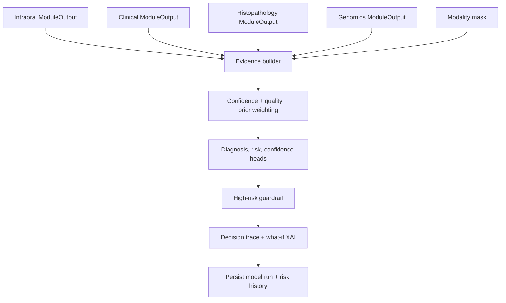

### Fusion output includes

- Diagnosis class and probability
- Risk class and score
- Calibrated confidence
- Modality contribution proportions
- Modality evidence details
- Decision trace
- What-if leave-one-out analysis
- Quality summary
- Prediction heads
- Warnings

### Why evidence-weighted late fusion

True multimodal training requires patient-matched intraoral, histopathology, clinical, and genomics data for the same patients. In hackathon and prototype settings, that is often unavailable. Evidence-weighted late fusion is safer because each modality can be trained independently, validated independently, and fused only at the decision layer.

This avoids pretending that unrelated datasets are patient-matched.

## 11. XAI and Explainability

Explainability exists at three levels.

### Modality-level XAI

- Intraoral: image model confidence and visual explanation placeholder or future Grad-CAM.
- Clinical: important clinical features and SHAP-style direction.
- Histopathology: Grad-CAM/anomaly heatmap and risk signal.
- Genomics: top gene features and preprocessing warnings.

### Fusion-level XAI

- Modality contribution proportions.
- Decision trace.
- Leave-one-out what-if output.
- Warnings for missing or disagreeing modalities.

### Patient-level XAI

- Simple language.
- No raw image bytes sent to the LLM.
- Uses processed summaries, report text, risk history, doctor details, and retrieved vector context.

## 12. RAG Chatbot Architecture

The chatbot is designed to answer from patient-specific context, not from generic hardcoded responses.

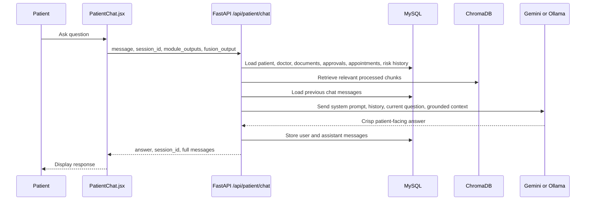

### RAG design

- ChromaDB stores processed text summaries and parsed clinical documents.
- Raw image bytes are not passed into the chatbot.
- For image modalities, only processed findings and fusion summaries are indexed.
- Local deterministic embeddings are used so the demo does not need to download an embedding model at runtime.

### LLM providers

The backend supports:

- Gemini, configured as the primary provider.
- Ollama with `llama3.1:8b` as local provider.
- Deterministic fallback if the LLM is unavailable.

Why this design:

- Gemini gives strong language quality for demos.
- Ollama enables offline/local operation.
- Fallback keeps the product usable even when an external LLM fails.

## 13. Persistence and Data Model

Primary database: MySQL.

Primary file storage: local artifact folders under `artifacts/`.

Vector store: ChromaDB under `artifacts/chromadb`.

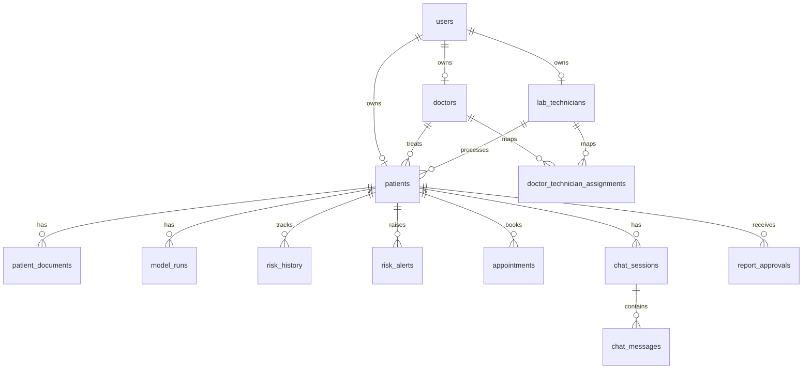

### Important tables

| Table | Purpose |
|---|---|
| `users` | Role-based demo users |
| `doctors` | Doctor profiles |
| `lab_technicians` | Lab technician profiles |
| `patients` | Patient records and assignments |
| `patient_documents` | Uploaded clinical, image, histology, genomics, and final documents |
| `model_runs` | Serialized module outputs and fusion output |
| `risk_history` | Longitudinal risk tracking |
| `risk_alerts` | High-risk or changed-risk alerts |
| `appointments` | Doctor-patient appointment tracking |
| `report_approvals` | Doctor-edited and approved reports |
| `chat_sessions` | Patient chat sessions |
| `chat_messages` | Full conversation history |
| `audit_events` | Auditable workflow events |

## 14. Main API Surface

| Endpoint | Purpose |
|---|---|
| `GET /api/health` | Health check and artifact availability |
| `GET /api/auth/demo-users` | Demo user list |
| `POST /api/auth/demo-login` | Demo login |
| `GET /api/me` | Current actor profile |
| `GET /api/doctors/{doctor_id}/patients` | Doctor patient list |
| `POST /api/patients` | Create patient |
| `GET /api/patients/{patient_id}` | Patient dashboard data |
| `GET /api/patients/{patient_id}/documents` | Patient documents |
| `GET /api/patients/{patient_id}/documents/{document_id}/view` | View uploaded file |
| `POST /api/patients/{patient_id}/documents` | Upload and process modality document |
| `POST /api/patients/{patient_id}/clinical-data` | Submit/edit clinical data |
| `GET /api/patients/{patient_id}/risk-history` | Longitudinal risk |
| `GET /api/patients/{patient_id}/alerts` | Patient alerts |
| `POST /api/patients/{patient_id}/appointments/request` | Request appointment |
| `GET /api/appointments` | List appointments |
| `PATCH /api/appointments/{appointment_id}` | Update appointment |
| `GET /api/genomics/schema` | Required genomics schema |
| `POST /api/genomics/validate` | Validate genomics input |
| `POST /api/genomics/train` | Train genomics artifact |
| `POST /api/genomics/infer` | Genomics JSON inference |
| `POST /api/genomics/infer-file` | Genomics file inference |
| `POST /api/fusion/infer` | Fusion inference |
| `POST /api/fusion/explain` | Fusion with rich XAI |
| `POST /api/reports/html` | HTML report |
| `POST /api/reports/pdf` | PDF report |
| `GET /api/patients/{patient_id}/approved-report/pdf` | Patient download of approved PDF |
| `POST /api/patients/{patient_id}/report-approval` | Doctor report approval |
| `POST /api/patient/query` | Single patient query |
| `POST /api/patient/chat` | Session-aware patient chatbot |

## 15. Complete Application Flows

### 15.1 Login and Role Routing

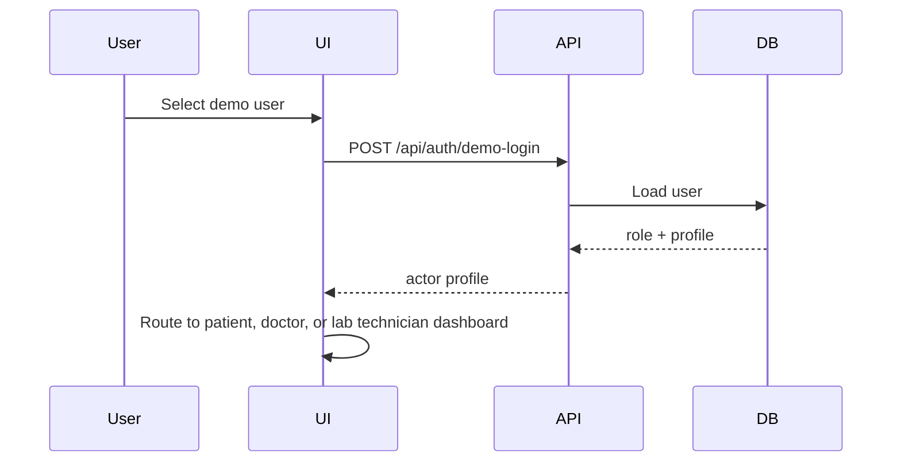

### 15.2 Lab Upload and Processing Flow

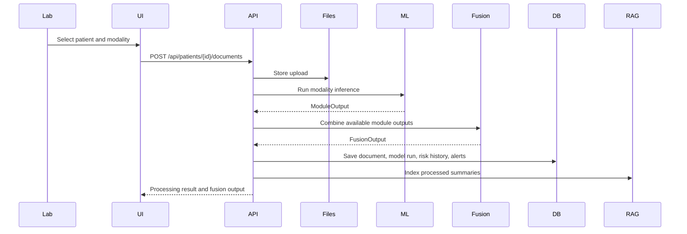

### 15.3 Patient Daily Intraoral Check

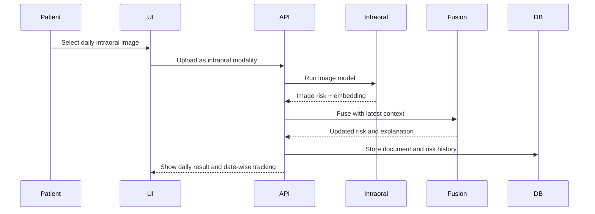

### 15.4 Doctor Review and Approval Flow

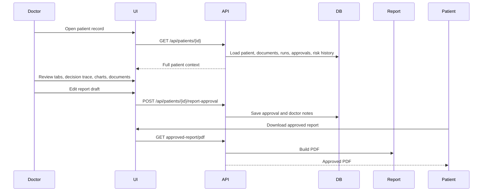

### 15.5 Appointment Flow

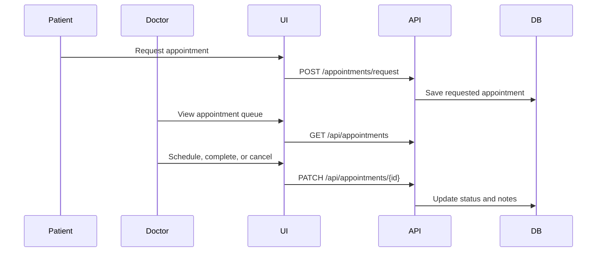

### 15.6 Report Generation Flow

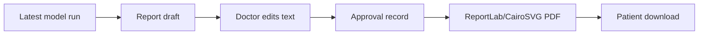

## 16. Tech Stack With Justification

| Layer | Technology | Why it was chosen |
|---|---|---|
| Frontend | React | Component model fits role-specific dashboards and reusable panels |
| Frontend build | Vite | Fast local development and simple production build |
| Charts | Recharts | Clean React-native charts for risk trends and modality proportions |
| Icons | Lucide React | Consistent clinical dashboard iconography |
| 3D UI | Three.js | Adds memorable visual feedback for lab processing without changing backend logic |
| Markdown rendering | React Markdown | Lets chatbot responses include safe simple formatting |
| Backend API | FastAPI | High-performance Python API with easy request validation and OpenAPI docs |
| Validation | Pydantic | Strong schemas for module outputs, fusion outputs, and API payloads |
| Database | MySQL | Durable relational storage for users, patients, appointments, approvals, and audit trails |
| File artifacts | Local filesystem | Simple prototype storage for uploads, model files, and reports |
| Vector DB | ChromaDB | Lightweight local vector search for patient-specific RAG context |
| PDF parsing | pypdf | Extracts text from uploaded clinical PDFs for RAG |
| Reports | ReportLab, CairoSVG, Jinja2 | Generates doctor-approved PDFs and SVG/HTML report artifacts |
| Image ML | PyTorch, Torchvision | Standard deep learning stack for EfficientNet image models |
| Intraoral model | EfficientNet-B0 | Efficient image model for local retraining and inference |
| Histopathology model | EfficientNet-B4 | Higher-capacity visual model for histology patterns |
| Genomics ML | scikit-learn, joblib | Reproducible tabular model artifacts and preprocessing |
| LLM | Gemini | Strong patient-facing answer quality |
| Local LLM fallback | Ollama | Offline/local demo option |
| RAG embeddings | Deterministic local embeddings | Avoids runtime model downloads and keeps demo reliable |
| Config | YAML | Central place for risk thresholds, model priors, roles, and LLM provider |

## 17. Security, Safety, and Privacy Choices

### Role-based access

- Patient sees only their own records.
- Doctor sees assigned patients.
- Lab technician sees assigned lab workflow patients.
- Backend access checks are enforced before sensitive data retrieval.

### Medical safety

- The system repeatedly states that output is decision support, not final diagnosis.
- Patient chatbot is instructed not to prescribe treatment or claim certainty.
- High-risk output is framed as a reason for clinical review.

### Privacy

- Raw image bytes are stored as documents but not passed to the LLM.
- RAG uses processed summaries and parsed text.
- Chatbot answers are grounded in patient context, not generic guesses.

### Auditability

- Model runs are persisted.
- Risk history is persisted.
- Report approvals are persisted.
- Chat sessions and messages are persisted.

## 18. Deployment and Run Commands

Backend:

```bash
.venv/bin/uvicorn backend.app.main:app --reload --host 127.0.0.1 --port 8000
```

Frontend:

```bash
cd frontend
npm run dev
```

Open:

```text
http://127.0.0.1:5173
```

Health check:

```bash
curl -s http://127.0.0.1:8000/api/health
```

Frontend production build:

```bash
cd frontend
npm run build
```

## 19. Model Training Commands

### Intraoral

Expected data:

```text
data/raw/intraoral/
  CANCER/
  NON CANCER/
```

Train:

```bash
.venv/bin/python -m backend.ml.phase1_intraoral_clinical.train_intraoral
```

Output:

```text
artifacts/models/intraoral_efficientnet.pt
```

### Histopathology

Expected data:

```text
data/raw/histopathology/
  train/
    OSCC/
    Normal/
  val/
    OSCC/
    Normal/
  test/
    OSCC/
    Normal/
```

Train:

```bash
.venv/bin/python -m backend.ml.phase2_histopathology.train_histopathology
```

### Clinical

Train:

```bash
.venv/bin/python -m backend.ml.phase1_intraoral_clinical.train_clinical
```

### Genomics

Schema:

```bash
curl http://127.0.0.1:8000/api/genomics/schema
```

Train:

```bash
.venv/bin/python -m backend.ml.phase3_genomics.train --input data/processed/tcga_hnsc_genomics_training.csv
```

Output:

```text
artifacts/genomics_model.joblib
```

## 20. Why This Is Impactful

Oral cancer outcomes depend heavily on early detection. But in real workflows, evidence is fragmented:

- A patient has photos.
- A lab has slides.
- A clinician has history.
- Genomics may arrive separately.
- Reports are written later.

OralCare-AI brings those streams into a single explainable timeline. It does not replace the doctor. It reduces fragmentation, makes risk visible earlier, and turns technical AI outputs into patient-understandable explanations.

## 21. Differentiators for Judges

1. Multimodal by design: not a single-image classifier.
2. Missing-modality-aware: useful even when only one or two reports are available.
3. Doctor-in-the-loop: doctor validates and edits before approval.
4. Patient-in-the-loop: daily intraoral uploads enable longitudinal early detection.
5. Explainable: modality contributions, decision trace, what-if XAI, and report narratives.
6. RAG chatbot: answers from patient-specific processed context, not raw images or generic text.
7. Operational workflow: appointments, document viewing, report approval, PDF download.
8. Model artifact support: trained genomics, intraoral, histopathology, and clinical paths can be plugged into the same fusion layer.

## 22. Demo Script for Judges

### 30-second opener

"OralCare-AI is an explainable multimodal decision-support system for oral cancer screening. Instead of giving a one-time score from one image, it combines intraoral photos, histopathology, clinical data, and genomics into a doctor-reviewed risk timeline. The goal is not to replace clinicians. The goal is to help them catch concerning changes earlier, explain why a case is high risk, and communicate clearly with patients."

### 2-minute product walkthrough

"We start with three roles: patient, doctor, and lab technician. The lab technician uploads modality-specific reports such as histopathology, genomics, or intraoral images. Each upload is processed into a standard model output containing prediction, confidence, embedding, warnings, and explanation.

Those outputs go into our fusion layer. The fusion model is missing-modality-aware, so it works even if only some modalities are available. It weights evidence using confidence, quality, prediction strength, and modality priors. The result is a fused risk score, diagnosis-support probability, modality contribution chart, and decision trace.

The doctor dashboard is built for review. The doctor can open a patient, view documents and images, inspect longitudinal risk, validate the decision trace, edit the report, and approve it. Only after approval does the patient get the final report in their dashboard.

The patient dashboard focuses on understandable care. Patients can upload daily intraoral images, track date-wise AI risk, download approved reports, request appointments, and ask the OralCare-AI chatbot questions in simple language. The chatbot uses RAG over processed patient data, not raw images, and it keeps full chat session history."

### 5-minute detailed script

"The clinical problem is that oral cancer evidence is fragmented. A suspicious lesion may appear in a phone photo, pathology may arrive later, genomics may be separate, and clinical risk factors live in structured notes. Most AI demos classify one image and stop there. Our system models the full clinical pathway.

Technically, every modality is normalized into a shared contract called `ModuleOutput`. This includes risk prediction, confidence, embedding, explanation, warnings, and quality flags. Intraoral and histopathology use EfficientNet-based image models. Clinical data uses an interpretable tabular risk model. Genomics uses an artifact-backed model with reproducible preprocessing.

The key architectural decision is evidence-weighted late fusion. We chose this because true patient-matched multimodal datasets are rare. Instead of pretending unrelated datasets are matched, we train each modality independently and fuse the evidence at the decision layer. The fusion layer also handles missing modalities, disagreement warnings, high-risk guardrails, and leave-one-out what-if analysis.

On the doctor side, this becomes a validation workspace. The doctor sees patients by name and risk level, opens a focused patient record, reviews uploaded documents, checks charts, validates the trace, edits the report, and approves it. This preserves clinical authority.

On the patient side, the system becomes a care companion. The patient can upload daily intraoral images. These are stored date-wise and added to the risk history. The chatbot answers crisply using patient-specific processed context, doctor details, report summaries, XAI output, and RAG retrieval. It avoids claiming diagnosis and explains risk in plain language.

The impact is early detection, continuity, and explainability. We are not just building a model. We are building a workflow that connects patients, labs, doctors, AI evidence, and approved reports."

### Demo sequence

1. Login as lab technician.
2. Select patient and upload intraoral or histopathology file.
3. Show processing and generated model/fusion output.
4. Login as doctor.
5. Show patient list with names, search, filters, risk stats, and charts.
6. Open one patient.
7. Show tabs: overview, documents, XAI, report, risk, appointments.
8. Edit and approve report.
9. Login as patient.
10. Show approved status, daily intraoral upload, risk trend, chatbot, appointment, and PDF download.

## 23. Strong Judge Q&A Answers

### Is this a diagnosis system?

"No. It is explicitly decision support. The doctor remains the final reviewer. The AI prioritizes and explains evidence, but the doctor validates, edits, and approves the report."

### Why multimodal?

"Oral cancer risk is not fully captured by one image. Intraoral photos, histopathology, clinical factors, and genomics each describe different parts of the disease pathway. Multimodal evidence gives a more complete review context."

### Why not train one giant multimodal model?

"Because true patient-matched multimodal datasets are rare. Training a single end-to-end model on mismatched datasets would be scientifically unsafe. Our late-fusion approach is more honest: each modality can be trained separately, and fusion handles missing evidence transparently."

### How do you explain the prediction?

"We explain at three levels: modality-specific features, fusion contribution proportions, and decision trace. Doctors can also run what-if analysis to see how risk changes when one modality is removed."

### Is patient privacy protected?

"The chatbot does not receive raw image bytes. It receives processed summaries, report text, risk history, doctor details, and retrieved context from the patient-specific vector store."

### What happens if the LLM fails?

"The system has a deterministic fallback. The product remains usable and still answers from structured patient context."

### What makes this useful in real hospitals?

"It preserves clinical authority. The lab uploads, the AI processes, the doctor reviews and approves, and the patient sees only approved status and simplified explanations. That matches how clinical responsibility actually works."

## 24. Roadmap

### Near-term

- Add real Grad-CAM for the intraoral model.
- Add model calibration plots and threshold tuning.
- Add model version display in every report.
- Add better patient-level train/validation splitting for image datasets.
- Add PDF preview in doctor workflow.

### Medium-term

- Integrate DICOM or WSI-compatible histopathology pipelines.
- Support cloud object storage for documents.
- Add full audit event views for administrators.
- Add clinician feedback loop for model improvement.
- Add FHIR-compatible export.

### Long-term

- Train on truly patient-matched multimodal cohorts.
- Validate externally across clinics and imaging devices.
- Add prospective clinical study workflow.
- Add explainability evaluation with clinician scoring.

## 25. Current Limitations

- This is a prototype and not clinically validated.
- Some modality models depend on available local artifacts.
- Fusion is evidence-weighted late fusion, not end-to-end patient-matched multimodal training.
- Local artifact storage is acceptable for prototype but should become object storage in production.
- RAG embeddings are deterministic local embeddings for reliability, not a medical-grade semantic embedding model.

## 26. One-Line Closing Pitch

"OralCare-AI turns fragmented oral cancer evidence into a doctor-reviewed, explainable, patient-understandable risk timeline."
